# 20 Easy Java Programs with Output

---

## 1. Basic Calculator

**Description:** A simple calculator program that reads two integers and displays their sum, difference, product, quotient, and remainder.

**File:** `p1Calc.java`

```java
import java.util.Scanner;

public class p1Calc {
    public static void main(String args[]) {
        int no1, no2, sum, diff, pro, rem;
        float quotient;
        
        Scanner sc = new Scanner(System.in);
        
        System.out.print("Enter first number: ");
        no1 = sc.nextInt();
        
        System.out.print("Enter second number: ");
        no2 = sc.nextInt();
        
        sum = no1 + no2;
        diff = no1 - no2;
        pro = no1 * no2;
        
        if (no2 != 0) {
            quotient = (float) no1 / no2;
            rem = no1 % no2;
        } else {
            quotient = 0;
            rem = 0;
        }
        
        System.out.println("Sum = " + sum);
        System.out.println("Difference = " + diff);
        System.out.println("Product = " + pro);
        System.out.println("Quotient = " + quotient);
        System.out.println("Remainder = " + rem);
    }
}
```

**Class Diagram:**

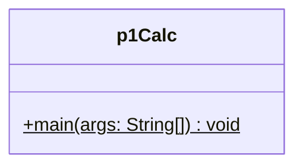

**Sample Output:**
```
Enter first number: 15
Enter second number: 4
Sum = 19
Difference = 11
Product = 60
Quotient = 3.75
Remainder = 3
```

---

## 2. Triangle Classification & Area

**Description:** Determines the type of triangle based on side lengths and computes its area using Heron’s formula.

**File:** `p2TriSides.java`

```java
import java.util.*;

public class p2TriSides {
    public static void main(String args[]) { 
        Scanner sc = new Scanner(System.in); 
        double a, b, c;
        System.out.println("Enter 3 sides:"); 
        a = sc.nextDouble(); 
        b = sc.nextDouble(); 
        c = sc.nextDouble(); 

        if (a > 0 && b > 0 && c > 0 && a < b + c && b < a + c && c < a + b) { 
            if (a == b && b == c) 
                System.out.println("Equilateral triangle"); 
            else if (a == b || b == c || c == a) 
                System.out.println("Isosceles triangle"); 
            else 
                System.out.println("Scalene triangle"); 

            double s = (a + b + c) / 2; 
            double area = Math.sqrt(s * (s - a) * (s - b) * (s - c)); 
            System.out.println("Area of the triangle is: " + area); 
        } else {
            System.out.println("Cannot form a triangle"); 
        } 
    }
}
```

**Class Diagram:**

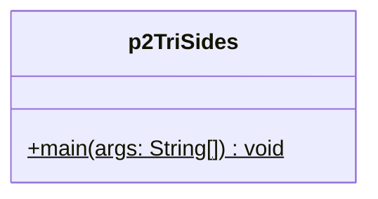

**Sample Output:**
```
Enter 3 sides:
3
4
5
Scalene triangle
Area of the triangle is: 6.0
```

---

## 3. Array: Find Smallest, Largest & Second Largest

**Description:** Reads a list of numbers, sorts them, and reports the smallest, largest, and second-largest values.

**File:** `p3ReadArr.java`

```java
import java.util.*;

public class p3ReadArr {
    public static void main(String args[]) { 
        Scanner sc = new Scanner(System.in);
        System.out.print("Enter number of elements (10 or more): ");
        int count = sc.nextInt();
        if (count < 10) {
            System.out.println("Please enter at least 10 elements.");
            return;
        }
        int arr[] = new int[count];
        System.out.println("Enter " + count + " elements:");
        for (int i = 0; i < count; i++) {
            arr[i] = sc.nextInt();
        }

        Arrays.sort(arr);
        System.out.println("Array = " + Arrays.toString(arr));
        System.out.println("Smallest: " + arr[0]);
        System.out.println("Largest: " + arr[count - 1]);
        System.out.println("Second largest: " + arr[count - 2]);
    } 
}
```

**Class Diagram:**

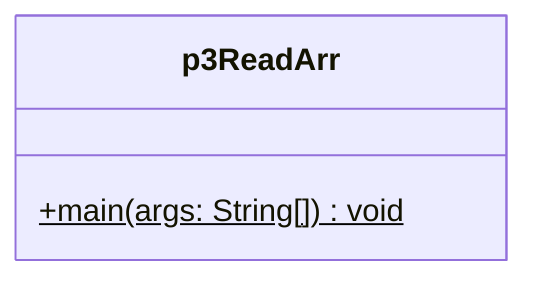

**Sample Output:**
```
Enter number of elements (10 or more): 10
Enter 10 elements:
5 2 8 9 1 6 3 7 4 10
Array = [1, 2, 3, 4, 5, 6, 7, 8, 9, 10]
Smallest: 1
Largest: 10
Second largest: 9
```

---

## 4. Base Conversion (Decimal to Binary, Octal, Hexadecimal)

**Description:** Converts a decimal integer into its hexadecimal, octal, and binary representations.

**File:** `p4BaseConversion.java`

```java
import java.util.Scanner; 

class Convert { 
    int num; 
    void getVal(Scanner sc) { 
        System.out.print("Enter the Number: "); 
        num = sc.nextInt(); 
    }

    void convert() { 
        String hx = Integer.toHexString(num).toUpperCase(); 
        System.out.println("Hexadecimal Value: " + hx); 
        String oc = Integer.toOctalString(num); 
        System.out.println("Octal Value: " + oc); 
        String bin = Integer.toBinaryString(num); 
        System.out.println("Binary Value: " + bin); 
    } 
} 

public class p4BaseConversion {
    public static void main(String args[]) { 
        Scanner sc = new Scanner(System.in);
        Convert c = new Convert(); 
        c.getVal(sc); 
        c.convert(); 
    }
}
```

**Class Diagram:**

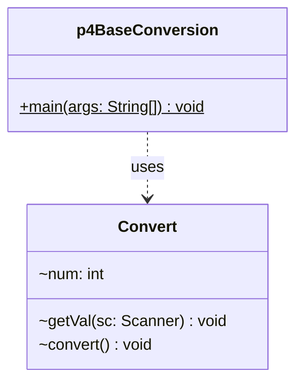

**Sample Output:**
```
Enter the Number: 25
Hexadecimal Value: 19
Octal Value: 31
Binary Value: 11001
```

---

## 5. Merge Two Arrays

**Description:** Accepts two arrays from the user and merges them into a single combined array.

**File:** `p5Merge2Arr.java`

```java
import java.util.Scanner; 

public class p5Merge2Arr { 
    public static void main(String args[]) { 
        int n1, n2, k; 
        int c[] = new int[100];
        Scanner sc = new Scanner(System.in);

        System.out.println("Enter number of elements in 1st array: "); 
        n1 = sc.nextInt(); 
        int a[] = new int[n1]; 
        System.out.println("Enter the 1st array elements: "); 
        for (int i = 0; i < n1; i++) { 
            a[i] = sc.nextInt(); 
            c[i] = a[i]; 
        }

        k = n1;
        System.out.println("Enter number of elements in 2nd array: "); 
        n2 = sc.nextInt(); 
        int b[] = new int[n2]; 
        System.out.println("Enter the 2nd array elements: "); 
        for (int i = 0; i < n2; i++) { 
            b[i] = sc.nextInt(); 
            c[k] = b[i]; 
            k++; 
        }

        System.out.println("1st array: "); 
        for (int i = 0; i < n1; i++) { 
            System.out.print(" " + a[i]); 
        }
        System.out.println();

        System.out.println("2nd array: "); 
        for (int i = 0; i < n2; i++) { 
            System.out.print(" " + b[i]); 
        }
        System.out.println(); 

        System.out.println("Merged array: "); 
        for (int i = 0; i < k; i++) { 
            System.out.print(" " + c[i]); 
        }
    } 
}
```

**Class Diagram:**

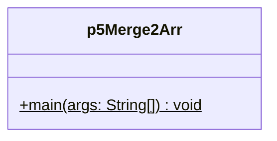

**Sample Output:**
```
Enter number of elements in 1st array: 
3
Enter the 1st array elements: 
1 2 3
Enter number of elements in 2nd array: 
3
Enter the 2nd array elements: 
4 5 6
1st array: 
 1 2 3
2nd array: 
 4 5 6
Merged array: 
 1 2 3 4 5 6
```

---

## 6. HCF (GCD) and LCM of Two Numbers

**Description:** Calculates the highest common factor and least common multiple of two integers.

**File:** `p6HCFLCM.java`

```java
import java.util.Scanner; 

public class p6HCFLCM {
    public static void main(String args[]) { 
        int temp1, temp2, num1, num2, temp, hcf, lcm; 
        Scanner sc = new Scanner(System.in); 
        System.out.print("Enter First Number: "); 
        num1 = sc.nextInt(); 
        System.out.print("Enter Second Number: "); 
        num2 = sc.nextInt(); 
        
        temp1 = num1; 
        temp2 = num2; 
        while(temp2 != 0) { 
            temp = temp2; 
            temp2 = temp1 % temp2; 
            temp1 = temp; 
        } 
        hcf = temp1; 
        lcm = (num1 * num2) / hcf; 
        System.out.println("HCF = " + hcf); 
        System.out.println("LCM = " + lcm); 
    }
}
```

**Class Diagram:**

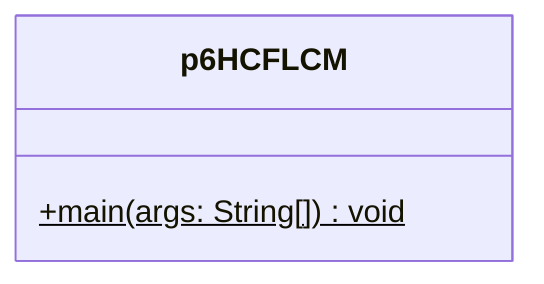

**Sample Output:**
```
Enter First Number: 12
Enter Second Number: 18
HCF = 6
LCM = 36
```

---

## 7. Matrix Trace and Transpose

**Description:** Displays a matrix entered by the user, its transpose, and computes the trace if it’s square.

**File:** `p7MatrixTraceAndTranspose.java`

```java
import java.util.Scanner;

public class p7MatrixTraceAndTranspose { 
    public static void main(String args[]) { 
        int row, col, i, j, sum = 0; 
        Scanner sc = new Scanner(System.in); 
        System.out.print("Enter Number of Rows: "); 
        row = sc.nextInt(); 
        System.out.print("Enter Number of Columns: "); 
        col = sc.nextInt(); 
        int mat1[][] = new int[50][50]; 
        System.out.println("Enter elements: "); 
        for(i = 0; i < row; i++) { 
            for(j = 0; j < col; j++) { 
                mat1[i][j] = sc.nextInt(); 
            } 
        } 

        System.out.println("Original Matrix: "); 
        for(i = 0; i < row; i++) { 
            for(j = 0; j < col; j++) { 
                System.out.print(" " + mat1[i][j]); 
            } 
            System.out.println(); 
        }

        System.out.println("Transpose of matrix: "); 
        for(i = 0; i < col; i++) { 
            for(j = 0; j < row; j++) { 
                System.out.print(" " + mat1[j][i]); 
            } 
            System.out.println(); 
        }

        if(row == col) { 
            for(i = 0; i < row; i++) { 
                for(j = 0; j < col; j++) { 
                    if(i == j) { 
                        sum = sum + mat1[i][j]; 
                    } 
                } 
            } 
            System.out.println("Trace = " + sum); 
        } else { 
            System.out.println("Only Square matrix contains trace."); 
        } 
    }
}
```

**Class Diagram:**

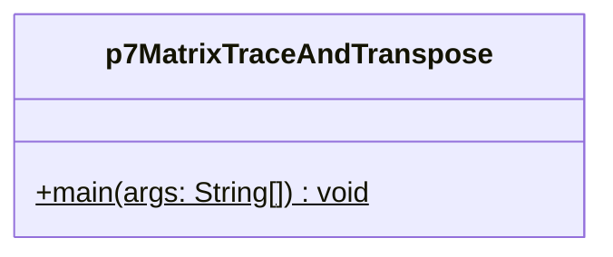

**Sample Output:**
```
Enter Number of Rows: 3
Enter Number of Columns: 3
Enter elements: 
1 2 3 4 5 6 7 8 9
Original Matrix: 
 1 2 3
 4 5 6
 7 8 9
Transpose of matrix: 
 1 4 7
 2 5 8
 3 6 9
Trace = 15
```

---

## 8. Sum of Digits and Reverse of a Number

**Description:** Computes both the reversed form of a number and the sum of its digits.

**File:** `p8DigSumAndReverse.java`

```java
import java.util.Scanner; 

class sumRev { 
    int rem, m, sum; 
    sumRev() { 
        m = 0; 
        sum = 0; 
        rem = 0; 
    } 
    void reverse(int n) { 
        do { 
            rem = n % 10; 
            m = m * 10 + rem; 
            n = n / 10; 
        } while(n > 0); 
        System.out.println("Reverse = " + m); 
    } 
    void digit(int n) { 
        rem = 0; 
        do { 
            rem = n % 10; 
            sum = sum + rem; 
            n = n / 10;
        } while(n > 0);
        System.out.println("Sum of the digits = " + sum); 
    }
} 
 
public class p8DigSumAndReverse { 
    public static void main(String args[]) { 
        Scanner sc = new Scanner(System.in); 
        System.out.print("Enter a number: "); 
        int num = sc.nextInt();
        sumRev obj = new sumRev();
        obj.reverse(num); 
        obj.digit(num);
    } 
}
```

**Class Diagram:**

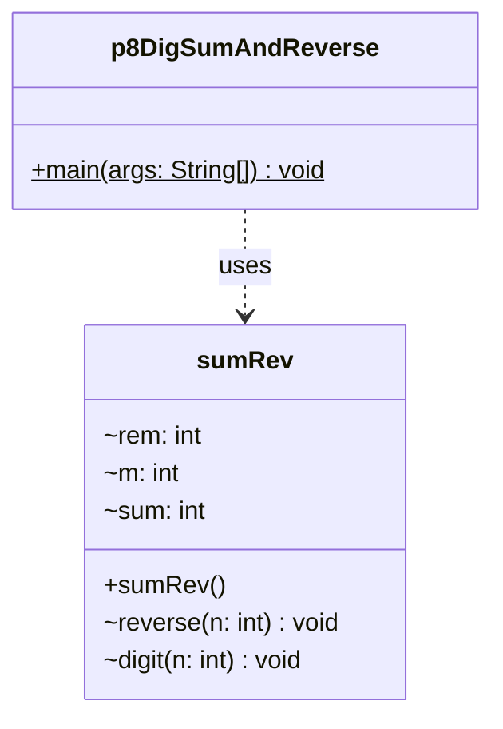

**Sample Output:**
```
Enter a number: 12345
Reverse = 54321
Sum of the digits = 15
```

---

## 9. Check if Strings are Anagrams

**Description:** Checks whether two input strings are anagrams of each other.

**File:** `p9Anagram.java`

```java
import java.util.Scanner; 

public class p9Anagram { 
    public static void main(String args[]) { 
        String str1, str2; 
        int len, len1, len2, i, j, flag = 0; 
        Scanner scan = new Scanner(System.in); 
        System.out.print("Enter first string: "); 
        str1 = scan.nextLine();

        System.out.print("Enter second string: "); 
        str2 = scan.nextLine(); 
        len1 = str1.length(); 
        len2 = str2.length(); 
        if(len1 == len2) { 
            len = len1; 
            for(i = 0; i < len; i++) { 
                flag = 0; 
                for(j = 0; j < len; j++) { 
                    if(str1.charAt(i) == str2.charAt(j)) { 
                        flag = 1; 
                        break; 
                    } 
                } 
                if(flag == 0) { 
                    break; 
                } 
            }
            if(flag == 0) { 
                System.out.println("Strings are not anagram to each other"); 
            } else { 
                System.out.println("Strings are anagram"); 
            } 
        } else { 
            System.out.println("Both strings must have same number of characters"); 
        } 
    } 
}
```

**Class Diagram:**

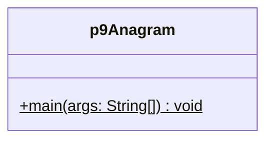

**Sample Output:**
```
Enter first string: listen
Enter second string: silent
Strings are anagram
```

---

## 10. Remove Vowels from String

**Description:** Removes all vowels from a given string and prints the result.

**File:** `p10RemoveVowels.java`

```java
import java.util.Scanner; 

public class p10RemoveVowels { 
    public static void main(String args[]) {
        String str1, str2; 
        Scanner sc = new Scanner(System.in); 
        System.out.print("Enter a String: "); 
        str1 = sc.nextLine(); 
        str2 = str1.replaceAll("[aeiouAEIOU]", " "); 
        System.out.println("All vowels removed successfully"); 
        System.out.println(str2); 
    } 
}
```

**Class Diagram:**


**Sample Output:**
```
Enter a String: Hello World
All vowels removed successfully
H ll  W rld
```

---

## 11. Student Details with Marks (Inheritance)

**Description:** Demonstrates inheritance by storing student admission numbers and subject marks, then calculating totals and results.

**File:** `p11StdDetails.java`

```java
import java.util.Scanner; 

class student {
    int admNo; 
    Scanner sc; 
    student() { 
        sc = new Scanner(System.in); 
    } 
    void read() { 
        System.out.print("Enter Admission number: ");
        admNo = sc.nextInt();
    } 
    void display() {
        System.out.print(admNo + "\t"); 
    }
} 
 
class mark extends student {
    int mark[];
    int total;
    int avg;
    int i;
    String result; 
    mark() { 
        super(); 
        mark = new int[5]; 
        total = 0; 
        avg = 0; 
    }
    void read() { 
        super.read(); 
        System.out.println("Enter 5 subject marks: "); 
        for (i = 0; i < 5; i++) { 
            System.out.print("Subject[" + (i + 1) + "]: "); 
            mark[i] = sc.nextInt();
        }
    } 
    void calculate() { 
        for (i = 0; i < 5; i++) { 
            total = total + mark[i]; 
        } 
        avg = total / 5; 
        if (total >= 175) { 
            result = "PASSED"; 
        } else { 
            result = "FAILED"; 
        } 
    } 
    void display() {
        super.display();
        System.out.println("Total: " + total + "\tAverage: " + avg + "\tResult: " + result);
    }
}

public class p11StdDetails {
    public static void main(String args[]) {
        mark m = new mark();
        m.read();
        m.calculate();
        m.display();
    }
}
```

**Class Diagram:**

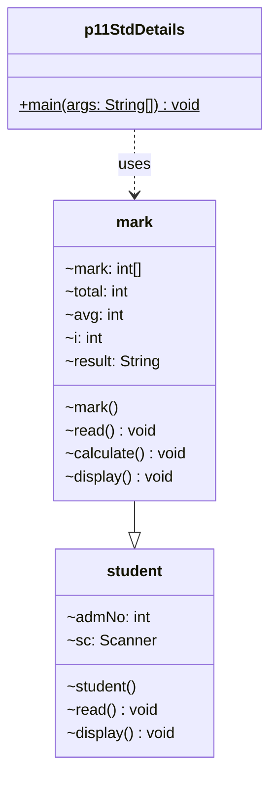

**Sample Output:**
```
Enter Admission number: 101
Enter 5 subject marks: 
Subject[1]: 85
Subject[2]: 90
Subject[3]: 78
Subject[4]: 88
Subject[5]: 92
101	Total: 433	Average: 86	Result: PASSED
```

---

## 12. Sum of Complex Numbers

**Description:** Defines a `Complex` class and adds two complex numbers provided by the user.

**File:** `p12sumOfComplexNo.java`

```java
import java.util.*; 

class Complex { 
    int real, imaginary; 
    Complex() {} 
    Complex(int tempReal, int tempImaginary) { 
        real = tempReal; 
        imaginary = tempImaginary; 
    } 
    Complex addComp(Complex c1, Complex c2) { 
        Complex temp = new Complex(); 
        temp.real = c1.real + c2.real; 
        temp.imaginary = c1.imaginary + c2.imaginary; 
        return temp;
    } 
}
 
public class p12sumOfComplexNo { 
    public static void main(String args[]) {
        Scanner sc = new Scanner(System.in); 
        System.out.println("Enter first real part number");
        int a = sc.nextInt();
        System.out.println("Enter first imaginary part number");
        int b = sc.nextInt();
        Complex c1 = new Complex(a, b); 
        System.out.println("Enter second real part number");
        int c = sc.nextInt(); 
        System.out.println("Enter second imaginary part number"); 
        int d = sc.nextInt(); 
        Complex c2 = new Complex(c, d); 
        System.out.println("Complex number 1: " + c1.real + "+" + c1.imaginary + "i"); 
        System.out.println("Complex number 2: " + c2.real + "+" + c2.imaginary + "i"); 
        Complex c3 = new Complex(); 
        c3 = c3.addComp(c1, c2); 
        System.out.println("Sum of Complex Numbers: " + c3.real + "+" + c3.imaginary + "i");
    } 
} 
```

**Class Diagram:**

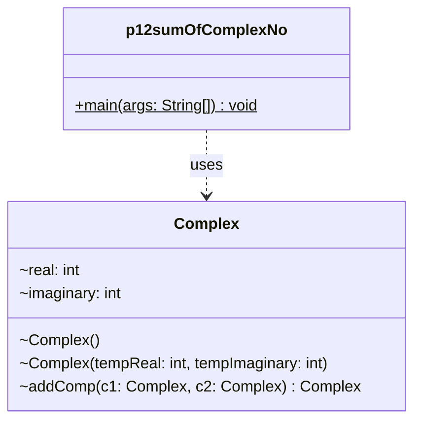

**Sample Output:**
```
Enter first real part number: 3
Enter first imaginary part number: 4
Enter second real part number: 2
Enter second imaginary part number: 5
Complex number 1: 3+4i
Complex number 2: 2+5i
Sum of Complex Numbers: 5+9i
```

---

## 13. Count Number of Objects Created

**Description:** Uses a static field to count how many instances of the class have been created.

**File:** `p13countNoOfObjects.java`

```java
public class p13countNoOfObjects {
    static int count = 0;
    
    p13countNoOfObjects() {
        count++;
    }
    
    public static void main(String args[]) {
        p13countNoOfObjects obj1 = new p13countNoOfObjects();
        p13countNoOfObjects obj2 = new p13countNoOfObjects();
        p13countNoOfObjects obj3 = new p13countNoOfObjects();
        p13countNoOfObjects obj4 = new p13countNoOfObjects();
        System.out.println("Number of Objects Created: " + count);
    }
}
```

**Class Diagram:**

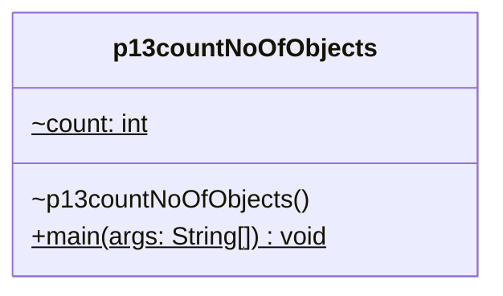

**Sample Output:**
```
Number of Objects Created: 4
```

---

## 14. Volume Calculation (Method Overloading)

**Description:** Demonstrates method overloading by calculating volumes of different shapes.

**File:** `p14volumeCalc.java`

```java
import java.util.*; 

class Overload {
    double area(float l, float w, float b) {
        return l * w * b;
    }
    double area(float l) { 
        return l * l * l;
    }
    double area(float r, float h) {
        return 3.14 * r * r * h;
    }
}

public class p14volumeCalc {
    public static void main(String args[]) { 
        Overload ov = new Overload(); 
        Scanner sc = new Scanner(System.in); 
        
        System.out.println("Enter length, width and height of rectangular box:");
        float l = sc.nextInt(); 
        float w = sc.nextInt(); 
        float h = sc.nextInt(); 
        double rect = ov.area(l, w, h); 
        System.out.println("Volume of rectangular box: " + rect);

        System.out.println("Enter edge length of Cube:"); 
        float e = sc.nextInt(); 
        double cube = ov.area(e); 
        System.out.println("Volume of Cube: " + cube); 
        
        System.out.println("Enter radius and height of Cylinder:");
        float r = sc.nextInt(); 
        float hi = sc.nextInt(); 
        double cyli = ov.area(r, hi); 
        System.out.println("Volume of Cylinder: " + cyli); 
    }
}
```

**Class Diagram:**

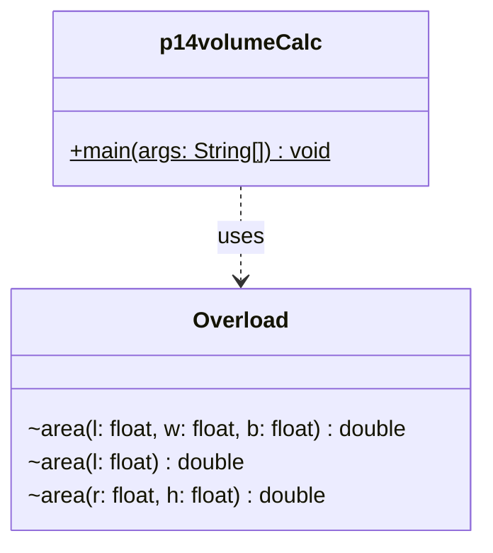

**Sample Output:**
```
Enter length, width and height of rectangular box:
5 4 3
Volume of rectangular box: 60.0
Enter edge length of Cube:
4
Volume of Cube: 64.0
Enter radius and height of Cylinder:
2 10
Volume of Cylinder: 125.6
```

---

## 15. Distance Between Two Points

**Description:** Computes the Euclidean distance between two points in the plane.

**File:** `p22distancebw2pt.java`

```java
import java.util.Scanner; 
 
public class p22distancebw2pt { 
    public static void main(String[] args) { 
        Scanner sc = new Scanner(System.in); 
 
        System.out.print("Enter x1: "); 
        double x1 = sc.nextDouble(); 
        System.out.print("Enter y1: "); 
        double y1 = sc.nextDouble(); 
 
        System.out.print("Enter x2: "); 
        double x2 = sc.nextDouble(); 
        System.out.print("Enter y2: "); 
        double y2 = sc.nextDouble(); 
 
        double distance = Math.sqrt(Math.pow((x2 - x1), 2) + Math.pow((y2 - y1), 2)); 
 
        System.out.println("The distance between the two points is: " + distance); 
        sc.close(); 
    }
}
```

**Class Diagram:**

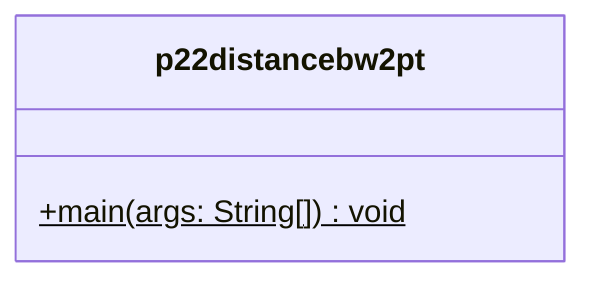

**Sample Output:**
```
Enter x1: 0
Enter y1: 0
Enter x2: 3
Enter y2: 4
The distance between the two points is: 5.0
```

---

## 16. Fibonacci Series up to Limit

**Description:** Prints Fibonacci numbers up to a user-specified limit.

**File:** `p23fibonacciUpToLt.java`

```java
import java.util.Scanner; 
 
public class p23fibonacciUpToLt {
    public static void main(String[] args) { 
        Scanner sc = new Scanner(System.in); 
 
        System.out.print("Enter the limit: "); 
        int limit = sc.nextInt(); 
 
        int first = 0, second = 1; 
 
        System.out.println("Fibonacci series up to " + limit + ":"); 
         
        while (first <= limit) { 
            System.out.print(first + " "); 
            int next = first + second; 
            first = second; 
            second = next; 
        } 
 
        sc.close(); 
    } 
}
```

**Class Diagram:**

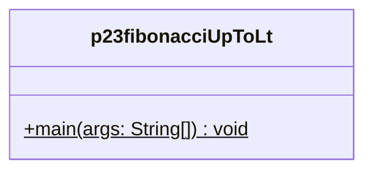

**Sample Output:**
```
Enter the limit: 50
Fibonacci series up to 50:
0 1 1 2 3 5 8 13 21 34
```

---

## 17. Armstrong Numbers Within Range

**Description:** Lists all Armstrong numbers between two given bounds.

**File:** `p24ArmstrongWithinRange.java`

```java
import java.util.Scanner; 
 
public class p24ArmstrongWithinRange {
    public static boolean isArmstrong(int num) { 
        int original = num, sum = 0, digits = 0; 
        int temp = num; 
        while (temp > 0) { 
            digits++; 
            temp /= 10; 
        } 
        temp = num; 
        while (temp > 0) { 
            int digit = temp % 10; 
            sum += Math.pow(digit, digits); 
            temp /= 10; 
        } 
 
        return sum == original; 
    } 
 
    public static void main(String[] args) { 
        Scanner sc = new Scanner(System.in); 
 
        System.out.print("Enter the starting number: "); 
        int start = sc.nextInt(); 
        System.out.print("Enter the ending number: "); 
        int end = sc.nextInt(); 
 
        System.out.println("Armstrong numbers between " + start + " and " + end + ":"); 
        for (int i = start; i <= end; i++) { 
            if (isArmstrong(i)) { 
                System.out.print(i + " "); 
            } 
        } 
 
        sc.close(); 
    } 
}
```

**Class Diagram:**

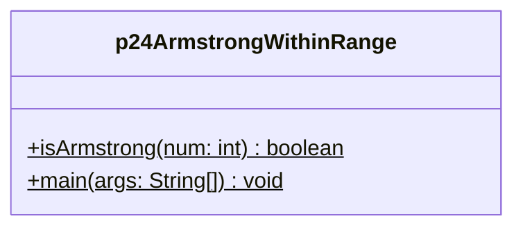

**Sample Output:**
```
Enter the starting number: 1
Enter the ending number: 1000
Armstrong numbers between 1 and 1000:
1 153 370 371 407
```

---

## 18. Prime Number Check

**Description:** Checks whether an input integer is prime.

**File:** `p17oddAndEvenNo.java` (Simplified version for prime checking)

```java
import java.util.Scanner;

public class PrimeCheck {
    public static boolean isPrime(int num) {
        if (num <= 1) return false;
        if (num == 2) return true;
        if (num % 2 == 0) return false;
        for (int i = 3; i * i <= num; i += 2) {
            if (num % i == 0) return false;
        }
        return true;
    }
    
    public static void main(String[] args) {
        Scanner sc = new Scanner(System.in);
        System.out.print("Enter a number: ");
        int num = sc.nextInt();
        
        if (isPrime(num)) {
            System.out.println(num + " is a Prime number");
        } else {
            System.out.println(num + " is not a Prime number");
        }
        sc.close();
    }
}
```

**Class Diagram:**

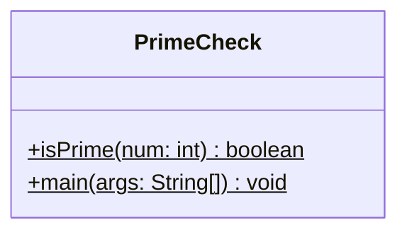

**Sample Output:**
```
Enter a number: 17
17 is a Prime number
```

---

## 19. Factorial of a Number

**Description:** Calculates the factorial of a given number recursively.

**File:** `FactorialProgram.java`

```java
import java.util.Scanner;

public class FactorialProgram {
    public static int factorial(int n) {
        if (n <= 1) return 1;
        return n * factorial(n - 1);
    }
    
    public static void main(String[] args) {
        Scanner sc = new Scanner(System.in);
        System.out.print("Enter a number: ");
        int num = sc.nextInt();
        
        System.out.println("Factorial of " + num + " = " + factorial(num));
        sc.close();
    }
}
```

**Class Diagram:**

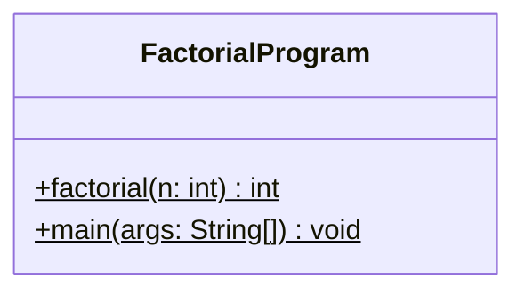

**Sample Output:**
```
Enter a number: 5
Factorial of 5 = 120
```

---

## 20. Check Odd or Even

**Description:** Determines whether a number is odd or even.

**File:** `OddEvenCheck.java`

```java
import java.util.Scanner;

public class OddEvenCheck {
    public static void main(String[] args) {
        Scanner sc = new Scanner(System.in);
        System.out.print("Enter a number: ");
        int num = sc.nextInt();
        
        if (num % 2 == 0) {
            System.out.println(num + " is an Even number");
        } else {
            System.out.println(num + " is an Odd number");
        }
        sc.close();
    }
}
```

**Class Diagram:**

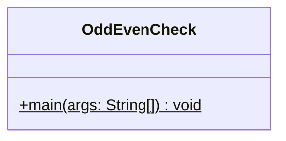

**Sample Output:**
```
Enter a number: 24
24 is an Even number
```

---

## Summary

| # | Program | File | Difficulty | Topic |
|---|---------|------|-----------|-------|
| 1 | Basic Calculator | p1Calc.java | ⭐ Easy | Arithmetic Operations |
| 2 | Triangle Classification | p2TriSides.java | ⭐ Easy | Conditionals |
| 3 | Array Min/Max/2nd Max | p3ReadArr.java | ⭐ Easy | Arrays |
| 4 | Base Conversion | p4BaseConversion.java | ⭐ Easy | Number Systems |
| 5 | Merge Arrays | p5Merge2Arr.java | ⭐ Easy | Arrays |
| 6 | HCF and LCM | p6HCFLCM.java | ⭐ Easy | Number Theory |
| 7 | Matrix Trace & Transpose | p7MatrixTraceAndTranspose.java | ⭐⭐ Medium | 2D Arrays |
| 8 | Sum & Reverse Digits | p8DigSumAndReverse.java | ⭐ Easy | Loops |
| 9 | Anagram Check | p9Anagram.java | ⭐⭐ Medium | Strings |
| 10 | Remove Vowels | p10RemoveVowels.java | ⭐ Easy | Strings |
| 11 | Student Marks | p11StdDetails.java | ⭐⭐ Medium | Inheritance |
| 12 | Complex Number Sum | p12sumOfComplexNo.java | ⭐ Easy | Classes/Objects |
| 13 | Count Objects | p13countNoOfObjects.java | ⭐ Easy | Static Variables |
| 14 | Volume Calculation | p14volumeCalc.java | ⭐ Easy | Method Overloading |
| 15 | Distance Between Points | p22distancebw2pt.java | ⭐ Easy | Math |
| 16 | Fibonacci Series | p23fibonacciUpToLt.java | ⭐ Easy | Loops |
| 17 | Armstrong Numbers | p24ArmstrongWithinRange.java | ⭐⭐ Medium | Number Theory |
| 18 | Prime Check | PrimeCheck.java | ⭐⭐ Medium | Loops |
| 19 | Factorial | FactorialProgram.java | ⭐ Easy | Recursion |
| 20 | Odd/Even Check | OddEvenCheck.java | ⭐ Easy | Conditionals |

---

**Created:** 20 Easy to Learn Java Programs for Beginners
**Total Programs:** 20
**Difficulty Level:** Beginner to Intermediate
